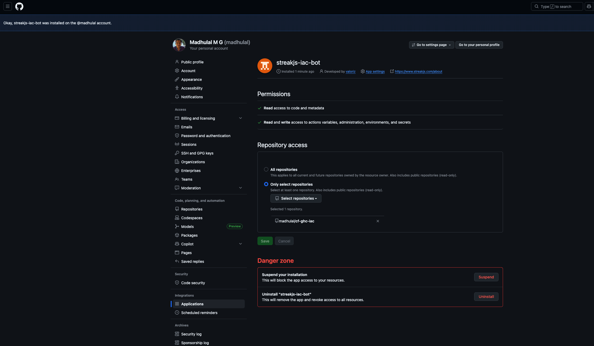
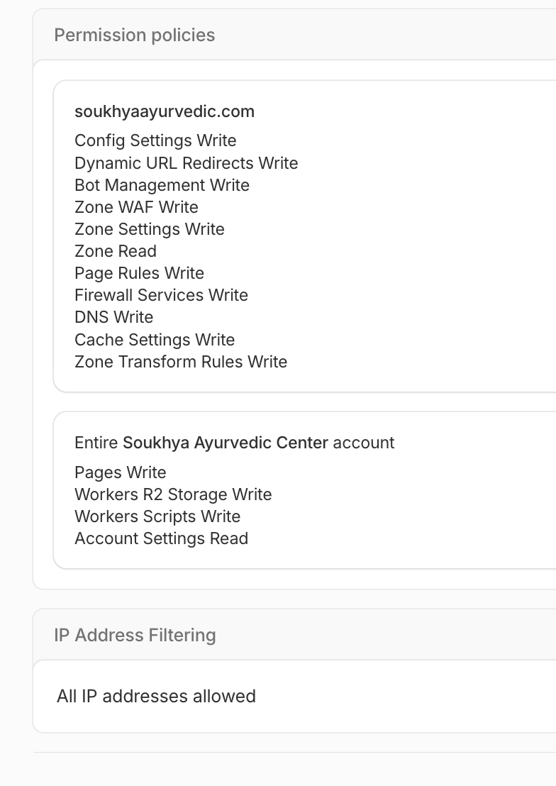

# GitHub Actions — IAC Cloudflare

Reusable GitHub Actions pipelines for Terraform (Cloudflare). Pipelines run from the **client repo**; Terraform code is cloned at runtime from the central `streakjs-common-infra` IaC repo using a GitHub App.

---

## How it works

1. This repo contains the workflow files and `.github/iac-config.json`
2. On workflow dispatch, the GitHub App generates a short-lived token to clone the IaC repo
3. The onboard workflow reads the config file and populates GitHub Environment secrets/variables
4. The create/destroy workflows use those environment secrets/variables to run Terraform

---

## Prerequisites

Before running any workflow, ensure the following are set up:

### 1. Install the GitHub App

The **streakjs-iac-bot** GitHub App must be installed on this repository. Contact the Valoriz DevOps team for the install link (e.g. `https://github.com/apps/streakjs-iac-bot`).

1. Open the install link → click **Install**
2. Select your account or organisation
3. Choose **Only select repositories** → select this repo
4. Click **Install** to confirm

> After installation, go to **Settings → GitHub Apps** on this repo to confirm `streakjs-iac-bot` appears in the list.

### 2. Add repository secrets

Go to **Settings → Secrets and variables → Actions → New repository secret** and add:

| Secret | Value | Source |
|---|---|---|
| `GH_APP_CLIENT_ID` | Numeric App ID | Provided by Valoriz DevOps |
| `GH_APP_PRIVATE_KEY` | Full `.pem` private key contents | Provided by Valoriz DevOps |
| `CF_API_TOKEN` | Cloudflare API token | See [Cloudflare API token](#cloudflare-api-token) below |

---

## Configuration

`.github/iac-config.json` drives the onboarding. Top-level fields are shared defaults; `environments.<env>` fields override them per environment.

| Field | Scope | Required | Description |
|---|---|---|---|
| `project_name` | shared / per-env | Yes | Terraform state slug |
| `cf_account_id` | shared / **per-env recommended** | Yes | Cloudflare account ID |
| `cf_worker_compatibility_date` | shared recommended | No | Workers compatibility date |
| `cf_r2_bucket_location` | shared / per-env | No | R2 location hint (default: `APAC`) |
| `cf_worker_name` | per-env | No | Worker script name |
| `cf_r2_bucket_name` | per-env | No | R2 bucket name |
| `cf_pages_name` | per-env | No | **Gates Pages creation** — omit to disable Pages for that env |
| `cf_pages_prod_branch` | per-env | No | Pages production branch |
| `cf_worker_custom_domains` | per-env | No | Array of `{hostname, zone_id}` |
| `cf_pages_custom_domain` | per-env | No | Object `{hostname, zone_id}` for Pages custom domain |
| `cf_manage_zone_resources` | per-env | No | `true` (default). Set to `false` when sharing a zone with another env |
| `cf_security_contact` | shared / per-env | No | Contact for `/.well-known/security.txt` |
| `cf_dmarc_policy` | shared / per-env | No | DMARC policy: `reject`, `quarantine`, or `none` |
| `cf_dmarc_rua` | shared / per-env | No | Email for DMARC aggregate reports |
| `extra_variables` | per-env | No | Key-value object of additional GitHub Environment variables (e.g. `{"SANITY_DATA_SET": "development"}`). Version-controlled and set automatically during onboarding. |

---

## How to Run

### Step 1 — Onboard (once per environment)

1. Update `.github/iac-config.json` with your environment values and commit to the repo.
2. Go to **Actions → IAC Onboard Repo → Run workflow**.
3. Select the target environment (`dev`, `qa`, `prod`).
4. Optionally provide `cf_api_token` at dispatch time to override the pre-stored `CF_API_TOKEN` secret.
5. The workflow clones the IaC repo, reads the config, creates the GitHub Environment, and sets all secrets and variables automatically.

Repeat for each environment.

### Step 2 — Apply (Create)

- **Actions → IAC Cloudflare Create → Run workflow** → select environment.

### Step 3 — Destroy

- **Actions → IAC Cloudflare Destroy → Run workflow** → select environment → type `destroy` to confirm.

### Step 4 — Offboard (remove environment config)

- **Actions → IAC Offboard Repo → Run workflow** → select environment.
- Deletes all variables and secrets from the GitHub Environment.
- Enable **delete_environment** to also remove the GitHub Environment itself.
- If it is the last environment, repository-level secrets (`CF_API_TOKEN`, `TF_STATE_SAS_TOKEN`) are also removed.

---

## Cloudflare API token

1. Cloudflare Dashboard → **Account Home** → **Manage Account** → **API Tokens** → **Create Token** → **Create Custom Token**

   > Use the **account-level** token page (not *My Profile → API Tokens*) so the token is owned by the account, not an individual user.

2. The token needs **two separate policies**:

**Policy 1 — Account** (resource: *Entire Account*)

| Category | Permission | Access |
|---|---|---|
| Account Settings | Account Settings | Read |
| Workers Scripts | Workers Scripts | Edit |
| Workers R2 Storage | Workers R2 Storage | Edit |
| Cloudflare Pages | Cloudflare Pages | Edit |

**Policy 2 — Zone** (required only when `cf_worker_custom_domains` is set)

Click **+ Add policy**, change the resource to **All zones** (or specific zones):

| Category | Permission | Access |
|---|---|---|
| Zone WAF | Zone WAF | Edit |
| Zone Settings | Zone Settings | Edit |
| Firewall Services | Firewall Services | Edit |
| DNS | DNS | Edit |
| Config Settings | Config Settings | Edit |
| Zone | Zone | Read |
| Page Rules | Page Rules | Edit |
| Bot Management | Bot Management | Edit |
| Dynamic URL Redirects | Dynamic URL Redirects | Edit |
| Cache Settings | Cache Settings | Edit |
| Zone Transform Rules | Zone Transform Rules | Edit |

3. Store as the `CF_API_TOKEN` repository secret.

---

## GitHub Environment variables set by onboard

| Variable / Secret | Type | Source |
|---|---|---|
| `TF_STATE_RESOURCE_GROUP` | Variable | IaC repo defaults |
| `TF_STATE_STORAGE_ACCOUNT` | Variable | IaC repo defaults |
| `TF_STATE_CONTAINER` | Variable | IaC repo defaults |
| `TF_STATE_PROJECT` | Variable | `project_name` from config |
| `CF_ACCOUNT_ID` | Variable | `cf_account_id` from config |
| `CF_WORKER_NAME` | Variable | `cf_worker_name` from config |
| `CF_R2_BUCKET_NAME` | Variable | `cf_r2_bucket_name` from config |
| `CF_WORKER_COMPATIBILITY_DATE` | Variable | `cf_worker_compatibility_date` from config |
| `CF_R2_BUCKET_LOCATION` | Variable | `cf_r2_bucket_location` from config |
| `CF_WORKER_CUSTOM_DOMAINS` | Variable | `cf_worker_custom_domains` from config |
| `CF_PAGES_WEB_CMS_NAME` | Variable | `cf_pages_name` from config |
| `CF_PAGES_PROD_BRANCH` | Variable | `cf_pages_prod_branch` from config |
| `CF_PAGES_CUSTOM_DOMAINS` | Variable | `cf_pages_custom_domains` from config |
| `CF_MANAGE_ZONE_RESOURCES` | Variable | `cf_manage_zone_resources` from config |
| `CF_SECURITY_CONTACT` | Variable | `cf_security_contact` from config |
| `CF_DMARC_POLICY` | Variable | `cf_dmarc_policy` from config |
| `CF_DMARC_RUA` | Variable | `cf_dmarc_rua` from config |
| Any keys in `extra_variables` | Variable | `extra_variables` from config |
| `CF_API_TOKEN` | Environment secret | `cf_api_token` dispatch input or pre-stored secret |
| `TF_STATE_SAS_TOKEN` | Repository secret | IaC repo defaults — shared across all environments |

---

## Troubleshooting

| Symptom | Fix |
|---|---|
| `Generate token for client repo` fails with 404 | GitHub App is not installed on this repository — install it via the app install link |
| `Generate token for IaC repo` fails with 404 | `GH_APP_CLIENT_ID` or `GH_APP_PRIVATE_KEY` secret is missing or incorrect |
| IaC checkout fails (401) | App is installed but does not have Contents read permission on `streakjs-common-infra` |
| Onboard fails writing secrets (403) | App is installed but missing Secrets/Variables/Environments write permissions — reinstall with correct permissions |
| `Config file not found` in onboard | Commit `.github/iac-config.json` to the default branch before running |
| `Environment 'X' not found` in config | Add the environment block to `iac-config.json` |
| Secrets not available in create/destroy | Variables must be under the **environment**, not just at repo level — re-run onboard |
| `403` on Terraform backend | `TF_STATE_SAS_TOKEN` expired or has insufficient permissions (needs List + Read + Write + Delete) |
| `Authentication error (10000)` on Cloudflare | `CF_API_TOKEN` missing a permission — check Policy 1 and Policy 2 against the tables above |
