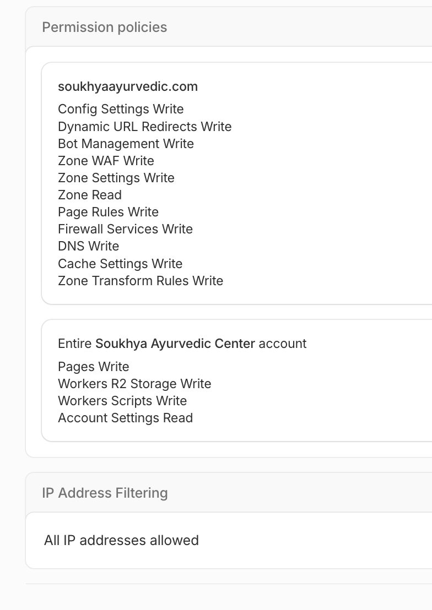

# GitHub Actions — IAC Cloudflare

Reusable GitHub Actions pipelines for Terraform (Cloudflare). Pipelines run from the **client repo**; Terraform code is cloned at runtime from this private IaC repo.

---

## How it works

1. Client repo contains the workflow files and a config file (`.github/iac-config.json`)
2. On workflow dispatch, the IaC repo is checked out using `GH_MASTER_REPO_ACCESS_TOKEN`
3. The onboard workflow reads the config file and populates GitHub Environment secrets/variables
4. The create/destroy workflows use those secrets/variables to run Terraform

---

## Setup in Client Repo

### 1. Copy files

Copy into the client repo:

| Source | Destination |
|---|---|
| `github-action-sample/workflows/iac-cf-onboard.yml` | `.github/workflows/iac-cf-onboard.yml` |
| `github-action-sample/workflows/iac-cf-offboard.yml` | `.github/workflows/iac-cf-offboard.yml` |
| `github-action-sample/workflows/iac-cf-create.yml` | `.github/workflows/iac-cf-create.yml` |
| `github-action-sample/workflows/iac-cf-destroy.yml` | `.github/workflows/iac-cf-destroy.yml` |
| `github-action-sample/iac-config.json` | `.github/iac-config.json` |

### 2. Fill in the config file

`.github/iac-config.json` drives the onboarding. Top-level fields are shared defaults; `environments.<env>` fields override them per environment.

See the sample config file: [github-action-sample/iac-config.json](../iac-config.json)

**Config field reference:**

| Field | Scope | Required | Description |
|---|---|---|---|
| `project_name` | shared / per-env | Yes | Terraform state slug |
| `cf_account_id` | shared / **per-env recommended** | Yes | Cloudflare account ID — set per-environment when dev/qa/prod use different Cloudflare accounts |
| `cf_worker_compatibility_date` | shared recommended | No | Workers compatibility date |
| `cf_r2_bucket_location` | shared / per-env | No | R2 location hint (default: `APAC`) |
| `cf_worker_name` | per-env | No | Worker script name |
| `cf_r2_bucket_name` | per-env | No | R2 bucket name |
| `cf_pages_name` | per-env | No | **Gates Pages creation** — omit to disable Pages for that env |
| `cf_pages_prod_branch` | per-env | No | Pages production branch |
| `cf_worker_custom_domains` | per-env | No | Array of `{hostname, zone_id}` |
| `cf_pages_custom_domains` | per-env | No | Object `{hostname, zone_id}` for Pages custom domain |
| `cf_manage_zone_resources` | per-env | No | `true` (default). Set to `false` when this env shares a Cloudflare zone with another env — prevents duplicate ruleset conflicts. See main README for full guidance |
| `cf_security_contact` | shared / per-env | No | Contact for `/.well-known/security.txt` (e.g. `mailto:security@example.com`). Leave empty to disable |
| `cf_dmarc_policy` | shared / per-env | No | DMARC policy: `reject`, `quarantine`, or `none`. Omit to skip DMARC record. Defaults to `reject` in CI |
| `cf_dmarc_rua` | shared / per-env | No | Email for DMARC aggregate reports. Leave empty to omit |

### 3. (Optional) Pre-store tokens as repository secrets

The three token inputs on the onboard workflow are all optional — if left blank at dispatch time, the workflow falls back to pre-stored **repository secrets**. This avoids re-entering them every time.

| Repository secret | Used for | When to pre-store |
|---|---|---|
| `GH_CLIENT_WRITE_TOKEN` | Creates GitHub Environments, sets secrets/variables | Store once; rotate when the PAT expires |
| `CF_API_TOKEN` | Cloudflare API access | Store once per client if the same token covers all environments |
| `GH_MASTER_REPO_ACCESS_TOKEN` | Clones the IaC repo | Stored automatically by the first onboard run; no manual action needed after that |

**Precedence:** dispatch input → pre-stored secret → error (if neither is set)

To pre-store a secret:
```
GitHub → Client repo → Settings → Secrets and variables → Actions → New repository secret
```

If a token changes (rotated, regenerated), simply enter the new value at dispatch time to override the stored secret — the onboard workflow will update the stored value automatically.

---

## How to Run

### Step 1 — Onboard (once per environment)

1. Commit `.github/iac-config.json` to the client repo.
2. Go to **Actions → IAC Onboard Repo → Run workflow**.
3. Fill in the inputs:

| Input | Required | Description |
|---|---|---|
| `environment` | Yes | `dev` / `qa` / `prod` |
| `gh_client_write_token` | No* | PAT with write access to this client repo. Leave blank to use the pre-stored `GH_CLIENT_WRITE_TOKEN` secret |
| `cf_api_token` | No* | Cloudflare API token for this client. Leave blank to use the pre-stored `CF_API_TOKEN` secret |
| `gh_master_repo_access_token` | No* | Read-only PAT for the IaC repo. Leave blank to use the pre-stored `GH_MASTER_REPO_ACCESS_TOKEN` secret |

*Required on first run (no pre-stored secrets yet). Optional on subsequent runs if secrets are already stored.

4. The workflow resolves each token (input takes precedence over stored secret), clones the IaC repo, reads the config file, creates the GitHub Environment, and stores all secrets and variables automatically.

Repeat for each environment.

### Step 2 — Apply (Create)

- **Actions → IAC Cloudflare Create → Run workflow** → select environment.

### Step 3 — Destroy

- **Actions → IAC Cloudflare Destroy → Run workflow** → select environment → type `destroy` to confirm.

### Step 4 — Offboard (remove environment config)

- **Actions → IAC Offboard Repo → Run workflow** → select environment → provide `client_write_token`.
- Deletes all variables and secrets set during onboarding from the GitHub Environment.
- Enable **delete_environment** to also remove the GitHub Environment itself.

---

## Local dry-run

Validate config parsing and variable mapping before running the workflow:

```bash
bash iac/cloudflare/scripts/onboard-local.sh \
  --repo org/my-client-repo \
  --env prod \
  --token <gh-write-pat> \
  --cf-token <cf-api-token> \
  --iac-token <gh-iac-read-pat> \
  --config .github/iac-config.json
# Prints all variables that would be set — no API calls made

# Add --execute to apply for real
```

---

## Token Setup

### `GH_MASTER_REPO_ACCESS_TOKEN` — IaC repo read token

The create/destroy/onboard workflows all clone this private IaC repo using this secret.

1. GitHub → **Settings** → **Developer settings** → **Personal access tokens** → **Fine-grained tokens** → **Generate new token**
2. **Resource owner:** the org that owns `streakjs-common-infra`
3. **Repository access:** select `streakjs-common-infra` only
4. **Permissions:** Contents → **Read-only**
5. Store the token as a **repository secret** named `GH_MASTER_REPO_ACCESS_TOKEN` in the client repo

### `client_write_token` — Client repo write token (dispatch-time only)

Used only during onboarding to create the GitHub Environment and set secrets/variables. Never stored.

1. Fine-grained PAT with access to the client repo
2. **Permissions:** Administration → Read and write, Secrets → Read and write, Variables → Read and write, Environments → Read and write

### Cloudflare API token

1. Cloudflare Dashboard → **Account Home** → **Manage Account** → **API Tokens** → **Create Token** → **Create Custom Token**

   > Use the **account-level** token page (not *My Profile → API Tokens*) so the token is owned by the account, not an individual user. This avoids CI failures if the token owner's account is removed.
2. The token needs **two separate policies** — account-level and zone-level permissions are configured independently:

**Policy 1 — Account** (resource: *Entire Account*)

| Category | Permission | Access |
|---|---|---|
| Account Settings | Account Settings | Read |
| Workers Scripts | Workers Scripts | Edit |
| Workers R2 Storage | Workers R2 Storage | Edit |
| Cloudflare Pages | Cloudflare Pages | Edit |

**Policy 2 — Zone** (required only when `cf_worker_custom_domains` is set)

Click **+ Add policy**, then change the resource dropdown from *Entire Account* to **All zones** (or restrict to the specific zones used in `cf_worker_custom_domains`). Zone-level permissions will then appear:

| Category | Permission | Access |
|---|---|---|
| Zone WAF | Zone WAF | Edit |
| Zone Settings | Zone Settings | Edit |
| Firewall Services | Firewall Services | Edit |
| DNS | DNS | Edit |
| Config Settings | Config Settings | Edit |
| Zone | Zone | Read |
| Page Rules | Page Rules | Edit |
| Bot Management | Bot Management | Edit |
| Dynamic URL Redirects | Dynamic URL Redirects | Edit |
| Cache Settings | Cache Settings | Edit |
| Zone Transform Rules | Zone Transform Rules | Edit |

> Zone-level permissions are needed for WAF rules, rate limiting, Always HTTPS, DNS records, redirects, config settings, Bot Fight Mode, caching, and security header transform rules. The "Zone: Read" permission is strictly required by Terraform to look up zone IDs. If you have no custom domains, skip Policy 2 entirely.



3. Store the token as the `cf_api_token` dispatch input during onboarding — it is saved as the `CF_API_TOKEN` environment secret automatically

---

## GitHub Environment variables set by onboard

After a successful onboard run, the selected GitHub Environment will contain:

| Variable / Secret | Type | Source |
|---|---|---|
| `TF_STATE_RESOURCE_GROUP` | Variable | IaC repo defaults |
| `TF_STATE_STORAGE_ACCOUNT` | Variable | IaC repo defaults |
| `TF_STATE_CONTAINER` | Variable | IaC repo defaults |
| `TF_STATE_PROJECT` | Variable | `project_name` from config |
| `CF_ACCOUNT_ID` | Variable | `cf_account_id` from config |
| `CF_WORKER_NAME` | Variable | `cf_worker_name` from config |
| `CF_R2_BUCKET_NAME` | Variable | `cf_r2_bucket_name` from config |
| `CF_WORKER_COMPATIBILITY_DATE` | Variable | `cf_worker_compatibility_date` from config |
| `CF_R2_BUCKET_LOCATION` | Variable | `cf_r2_bucket_location` from config |
| `CF_WORKER_CUSTOM_DOMAINS` | Variable | `cf_worker_custom_domains` from config |
| `CF_PAGES_WEB_CMS_NAME` | Variable | `cf_pages_name` from config |
| `CF_PAGES_PROD_BRANCH` | Variable | `cf_pages_prod_branch` from config |
| `CF_PAGES_CUSTOM_DOMAINS` | Variable | `cf_pages_custom_domains` from config |
| `CF_MANAGE_ZONE_RESOURCES` | Variable | `cf_manage_zone_resources` from config |
| `CF_SECURITY_CONTACT` | Variable | `cf_security_contact` from config |
| `CF_DMARC_POLICY` | Variable | `cf_dmarc_policy` from config |
| `CF_DMARC_RUA` | Variable | `cf_dmarc_rua` from config |
| `TF_STATE_SAS_TOKEN` | Secret | IaC repo defaults |
| `GH_MASTER_REPO_ACCESS_TOKEN` | Secret | `--iac-token` dispatch input |
| `CF_API_TOKEN` | Secret | `cf_api_token` dispatch input |

---

## Cloudflare free plan compatibility

All resources created by this IaC work on the **Cloudflare Free plan**:

| Resource | Free plan limits |
|---|---|
| Worker script | 100k requests/day, 10ms CPU per request |
| R2 bucket | 10 GB storage, 1M Class A ops/month, 10M Class B ops/month |
| Pages project | 500 builds/month, unlimited sites and requests |
| Worker custom domain | Unlimited |
| Always HTTPS, TLS 1.2/1.3, HTTP/3, 0-RTT, Brotli, Early Hints, Auto HTTPS rewrites | Free zone settings |
| Custom WAF rules | Up to 5 rules per zone |
| Rate limiting | 1 rule per zone; IP-based; 10-second fixed window; throttle on breach |
| Bot Fight Mode | Via `cloudflare_bot_management` (`fight_mode = true`) |
| HSTS, cache rules, redirect rules, security config | Free ruleset engine |

## Manual steps after first apply

These steps cannot be automated due to Cloudflare provider or API limitations:

| Step | Where | Why |
|---|---|---|
| Enable **Smart Placement** | Dashboard → Workers & Pages → your worker → Settings → General → Placement → set to **Smart** | Terraform provider v5 bug — `placement` object causes multipart metadata error on upload |
| Enable **Bot Fight Mode** visibility check | Dashboard → Security → Bots | Verify `fight_mode` applied correctly — the `cloudflare_bot_management` resource does not emit a creation confirmation in all zones |
| **Verify Pages custom domain** status | Dashboard → Workers & Pages → your Pages project → Custom domains | Domain moves from *Verifying* to *Active* automatically once DNS propagates (usually 1–5 minutes) |

---

## Local Terraform validation

Before pushing changes, validate the Terraform configuration locally — no real credentials needed:

```bash
bash iac/cloudflare/scripts/local-validate.sh
```

Runs: `terraform fmt` → `terraform validate` → Plan A (minimal) → Plan B (full with custom domains + Pages).

```bash
bash iac/cloudflare/scripts/local-validate.sh --skip-plan  # fmt + validate only
```

---

## Troubleshooting

| Symptom | Fix |
|---|---|
| `Config file not found` in onboard | Commit `.github/iac-config.json` to the default branch before running |
| `Environment 'X' not found` | Add the environment block to `iac-config.json` |
| IaC checkout fails (401 / 404) | `GH_MASTER_REPO_ACCESS_TOKEN` missing, expired, or wrong repo; regenerate with Contents: Read |
| Secrets not available in create/destroy | Variables must be under the **environment**, not just at repo level |
| `403` on Terraform backend | `TF_STATE_SAS_TOKEN` expired or has insufficient permissions (needs List + Read + Write + Delete) |
| Pages created unexpectedly | `cf_pages_name` is set in config when it should not be — remove it for that environment |
| `Authentication error (10000)` on any zone resource | Token is missing a zone-level permission — check Policy 2 against the full table in **Token Setup** above |
| `Missing expression` on `terraform init` | A GitHub variable (`CF_PAGES_CUSTOM_DOMAINS` or `CF_WORKER_CUSTOM_DOMAINS`) is unset — the workflow defaults to `null`/`[]` automatically since v5 migration |
